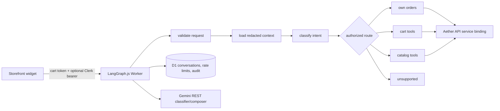

# Aether AI architecture

The production assistant is a TypeScript Cloudflare Worker orchestrated by LangGraph.js. It uses the existing Aether API as the only source of truth for catalog, prices, inventory, carts, identity, and orders.

The graph nodes are declared in `apps/ai-assistant/worker.ts` and covered by `assistant.test.ts`. Mutations remain deterministic and require a signed cart token. Order tools forward a syntactically valid Clerk bearer to `/api/v1/orders`; the API verifies the JWT and scopes every query to the signed-in shopper.

The Worker does not expose model credentials to the browser. Conversation content is redacted before D1 persistence and expires according to `AI_CONVERSATION_RETENTION_DAYS`.
